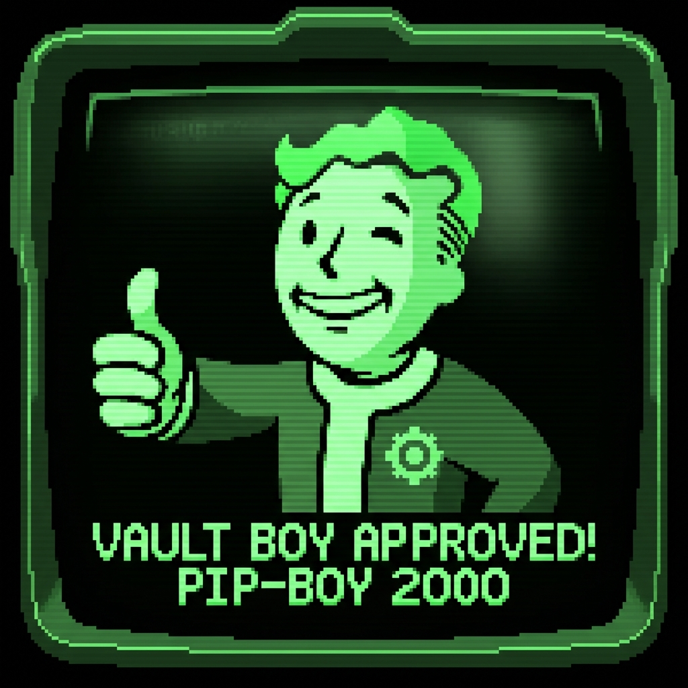

# Pip-Boy Toolkit

A Fallout-themed Pomodoro timer with authentic Pip-Boy aesthetics from the Fallout series.

## Features

- **Authentic Pip-Boy Theme**: Monochrome green CRT display with scanlines and screen curvature
- **Pomodoro Timer**: Three modes - Work (25min), Short Break (5min), Long Break (15min)
- **Retro Sound Effects**: Synthesized audio using Web Audio API
  - Button clicks
  - Continuous Geiger counter radiation sounds
  - Alarm when timer completes
- **Nuclear Finale**: Pixel art mushroom cloud explosion when session ends
- **Pure Vanilla**: No frameworks, just HTML/CSS/JavaScript

## Usage

### Local

1. Open `index.html` in your browser
2. Click anywhere to enable audio
3. Select a mode (WORK/SHORT/LONG)
4. Click **INITIALIZE** to start
5. Use **HALT** to pause, **RESET** to restart

### GitHub Pages

Visit: https://thisnamewasnottaken.github.io/pip-boy-toolkit/

The app is automatically deployed and updated whenever changes are pushed to the main branch.

### Test Mode

Enable **Debug / Test Mode** in the **SETTINGS** module to activate experimental features like the manual explosion trigger. This preference is saved locally for your session. (Legacy support: Appending `#test` to the URL also enables these features).

## Regression Testing

To ensure stability across all modules, this project uses [Playwright](https://playwright.dev/) for automated E2E testing. 

### Running Tests
1.  **Install**: `npm install`
2.  **Browser Setup**: `npx playwright install`
3.  **Run**: `npm test`

The test suite covers:
- **Main Menu**: Header consistency and navigation.
- **Timer**: Mode switching and finale animations.
- **Settings**: Persistent storage and Test Mode integration.

### CI/CD
Tests are automatically run on every push to the `master` branch. Deployments only proceed if the regression suite passes. ✨

- Vanilla JavaScript (ES6 classes)
- Web Audio API for sound synthesis
- CSS3 animations and effects
- Google Fonts (VT323, Share Tech Mono)

## Project Structure

This project follows a modular architecture to allow for easy expansion of Pip-Boy themed tools.

- `index.html` - Hub / Main Menu for the toolkit.
- `core/` - Shared assets and logic for the Pip-Boy aesthetic.
  - `css/main.css` - CRT effects, colors, and shared layout.
  - `js/main.js` - Sound synthesis and global UI behaviors.
- `tools/` - Individual toolkit modules.
  - `pomodoro/` - The Retro Pomodoro timer.
- `assets/images/` - Shared image assets (Vault Boy, etc.).
- `README.md` - You are here.

## Roadmap

The project is actively expanding. Below are the current objectives and upcoming features.

### Upcoming Objectives
- [ ] **Refinement**: Continued cross-browser testing and touch interaction polish for all modules.
- [ ] **Build Specifications**: Build specifications for the toolkit prototype that can be used to generate the full application. This will include an architectural overview, design specifications, and implementation plan.

## Deployment

The toolkit is optimized for GitHub Pages. Any changes pushed to the `main` branch are automatically deployed to:
https://thisnamewasnottaken.github.io/pip-boy-toolkit/

## License
MIT License - Feel free to use and modify!

## Credits
Inspired by the Fallout series Pip-Boy interface. All code and assets created for this project.
