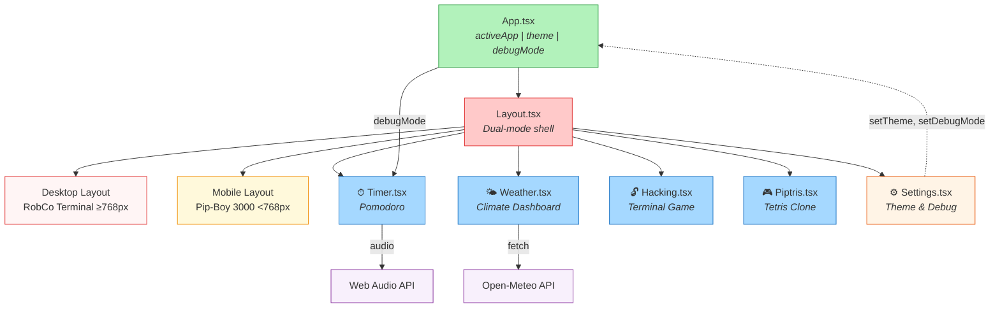
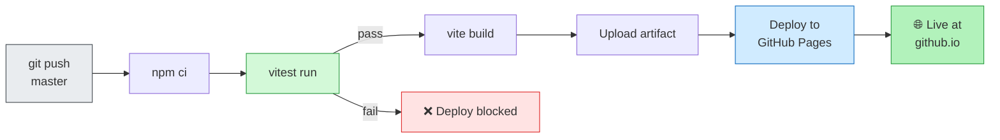

# Pip-Boy OS

> **RobCo Industries Unified Operating System v8.0.1**
>
> A Fallout-themed personal dashboard featuring dual-mode responsive design: RobCo Terminal (desktop) and Pip-Boy 3000 (mobile).


[](https://github.com/thisnamewasnottaken/pip-boy-toolkit/actions/workflows/static.yml)


## Features

### 🖥️ Dual-Mode Responsive Design

| Desktop (RobCo Terminal) | Mobile (Pip-Boy 3000) |
|---|---|
| Side navigation with chunky borders | Bottom tab navigation |
| Full-width data visualizations | Compact, wrist-mounted aesthetic |
| CRT scanline overlay with glow effects | Screen glare and curvature simulation |

### 📦 Modules

| Module | Description |
|---|---|
| **Timer** | Pomodoro timer with 25/5 min cycles, escalating audio alerts, and skull animation on completion |
| **Climate** | Real-time weather dashboard with Open-Meteo API, 24h forecast chart, UV/rainfall tracking |
| **Hacking** | Fallout-style terminal hacking game with memory dump, word matching, and attempt tracking |
| **Piptris** | Tetris clone with level progression, row clearing, and classic scoring system |
| **Settings** | Theme selection (Green/Amber/White/Blue), debug mode toggle, system info display |

### 🎨 Theme System

Four terminal color themes, switchable in real-time:

- **ROBCO GREEN** — Classic Pip-Boy phosphor green
- **TERMINAL AMBER** — Warm amber CRT terminal
- **VAULT-TEC WHITE** — Clean white terminal text
- **NUKA BLUE** — Cool blue display

All themes include CRT scanline effects, screen flicker, and text glow.

## Tech Stack

| Layer | Technology |
|---|---|
| Framework | React 19 + TypeScript 5.8 |
| Build Tool | Vite 6 |
| Styling | Tailwind CSS 4 |
| Animations | Motion (Framer Motion) |
| Charts | Recharts |
| Icons | Lucide React |
| Testing | Vitest + React Testing Library |
| Deployment | GitHub Pages (automated via Actions) |

## Getting Started

### Prerequisites

- **Node.js** 20+
- **npm** 10+

### Local Development

```bash
# Install dependencies
npm install

# Start dev server (http://localhost:3000)
npm run dev

# Type check
npm run lint

# Run tests
npm test

# Build for production
npm run build

# Preview production build
npm run preview
```

### Test Mode

Navigate to **SETTINGS** → toggle **TEST MODE** to enable accelerated timers (5s work / 3s break) for rapid Pomodoro testing.

## Project Structure

```
pip-boy-toolkit/
├── index.html              # HTML entry point
├── vite.config.ts          # Vite + Tailwind + Vitest config
├── tsconfig.json           # TypeScript configuration
├── package.json            # Dependencies and scripts
├── src/
│   ├── main.tsx            # React entry point
│   ├── App.tsx             # Root component with SPA routing
│   ├── index.css           # Tailwind + CRT design system
│   ├── vite-env.d.ts       # Vite type declarations
│   ├── components/
│   │   ├── Layout.tsx      # Dual-mode layout (RobCo + Pip-Boy)
│   │   ├── Timer.tsx       # Pomodoro timer module
│   │   ├── Weather.tsx     # Climate/weather dashboard
│   │   ├── Hacking.tsx     # Terminal hacking game
│   │   ├── Piptris.tsx     # Tetris clone
│   │   └── Settings.tsx    # Theme & debug settings
│   └── test/
│       ├── setup.ts        # Test library setup
│       ├── Timer.test.tsx   # Timer unit tests (8)
│       ├── Hacking.test.tsx # Hacking unit tests (8)
│       ├── Settings.test.tsx# Settings unit tests (9)
│       └── Piptris.test.tsx # Piptris unit tests (7)
├── docs/
│   ├── ARCHITECTURE.md     # Technical architecture overview
│   ├── architecture.excalidraw    # System architecture diagram
│   └── components.excalidraw      # Component relationship diagram
├── .github/
│   └── workflows/
│       └── static.yml      # CI/CD: test → build → deploy
└── assets/                 # Static assets (images)
```

## Architecture

See [docs/ARCHITECTURE.md](docs/ARCHITECTURE.md) for a detailed technical overview.

### Component Hierarchy



### Key Design Decisions

- **SPA over Multi-Page**: Single page app with state-based routing for instant module switching and seamless animations
- **Dual Layout Strategy**: Completely separate desktop (RobCo Terminal) and mobile (Pip-Boy 3000) layouts rather than a single responsive breakpoint
- **CSS Variables for Theming**: `--term-color` cascades through all components via CSS custom properties, enabling instant theme switching
- **Static-First Architecture**: No backend required — deployable to any static host (GitHub Pages, Netlify, Vercel)
- **Open-Meteo API**: Free, no-API-key weather data eliminates key exposure concerns on static hosting

### CI/CD Pipeline



Tests must pass before deployment proceeds. See `.github/workflows/static.yml`.

## Testing

```bash
# Run all tests
npm test

# Run in watch mode
npm run test:watch

# Run with coverage
npm run test:coverage
```

### Test Coverage

Live coverage is tracked by [Codecov](https://codecov.io/gh/thisnamewasnottaken/pip-boy-toolkit) and updated on every push to `master`. Click the badge at the top of this file for a full breakdown.

| Component | Tests | What's covered |
|-----------|-------|----------------|
| Timer | 8 | Start/pause, reset, mode switching, countdown, alerts |
| Hacking | 8 | Word display, guessing, attempts, game over, reboot |
| Settings | 9 | Theme selection, debug toggle, active states, system info |
| Piptris | 7 | Board render, grid dimensions, controls, initial state |
| **Total** | **33** | |

Run `npm run test:coverage` locally for a full V8 report in `coverage/`.

## License

MIT License — See [LICENSE](LICENSE) for details.

## Credits

Inspired by the Fallout series Pip-Boy interface by Bethesda Game Studios.
Built with React, TypeScript, Vite, Tailwind CSS, and Recharts.
