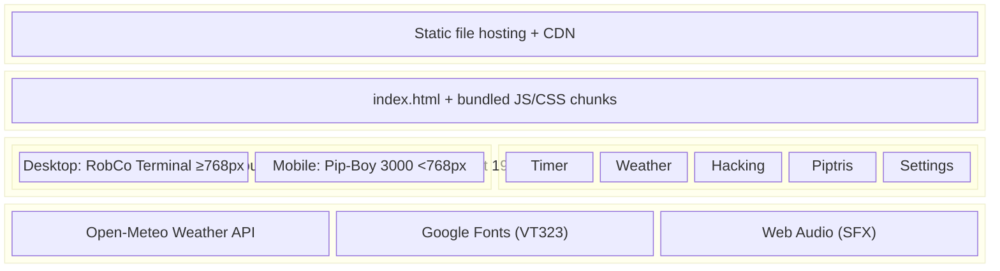
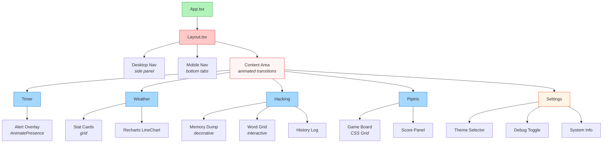
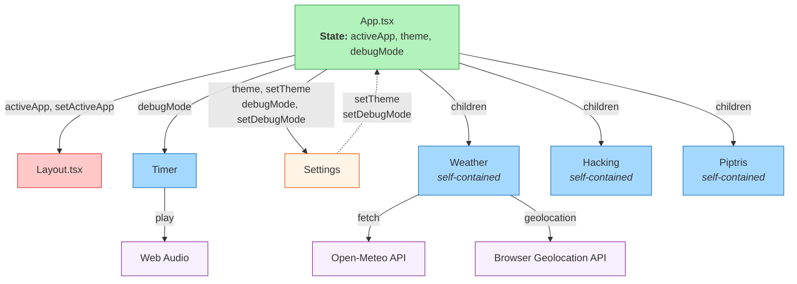
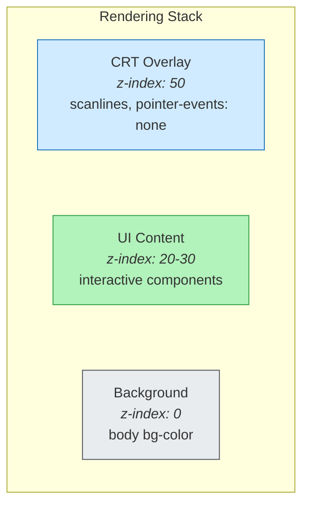
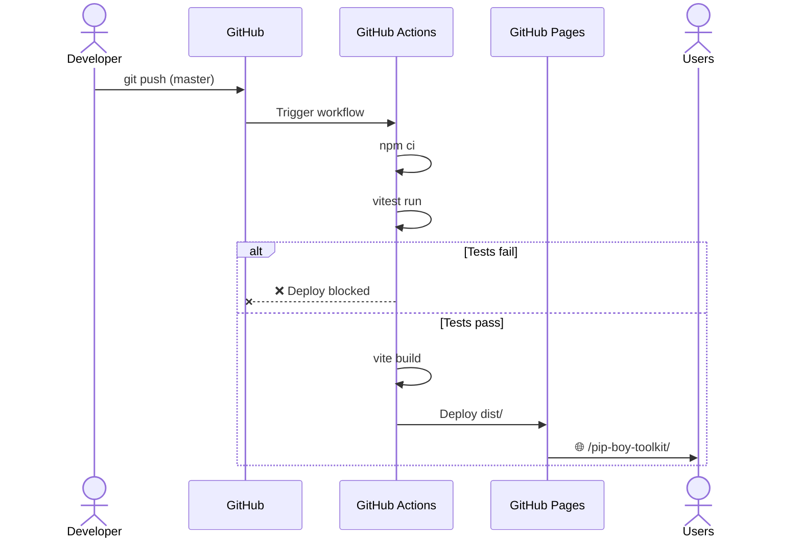

# Architecture Overview

## System Architecture

Pip-Boy OS is a **static single-page application (SPA)** built with React 19, TypeScript, and Vite, deployed to GitHub Pages. The architecture follows a modular component pattern with dual responsive layouts.

## High-Level Architecture



## Component Architecture

### Component Hierarchy



### Data Flow



## Design System

### CSS Architecture

The design system uses **Tailwind CSS v4** with custom theme tokens defined in `index.css`:

```css
@theme {
  --color-term-green: #4ade80;    /* Default phosphor green */
  --color-term-amber: #fbbf24;    /* Amber CRT */
  --color-term-white: #f8fafc;    /* White terminal */
  --color-term-blue: #60a5fa;     /* Blue display */
  --color-term-bg: #050505;       /* Near-black background */
  --font-mono: 'VT323', monospace;/* Retro terminal font */
}
```

### Theme Switching Mechanism

1. `App.tsx` stores theme state (e.g., `'theme-green'`)
2. Applied to `<body className={theme}>` via `useEffect`
3. Each theme class sets `--term-color` CSS custom property
4. All components reference `var(--term-color)` for their colors
5. Result: instant, cascading theme change across the entire UI

### CRT Effect Layers



Effects applied:
- **Scanlines**: Alternating transparent/dark horizontal lines, animated scrolling
- **Flicker**: Subtle opacity oscillation (0.85–0.95)
- **Glow**: `text-shadow` with theme color for CRT phosphor glow
- **Chunky borders**: Double-width borders with inset/outset box-shadow

## Module Specifications

### Timer (Pomodoro)

| Feature | Details |
|---------|---------|
| Work duration | 25 min (5 sec in debug mode) |
| Break duration | 5 min (3 sec in debug mode) |
| Alert system | Escalating audio (volume ramps every 10s) |
| Visual alert | Full-screen skull animation overlay |
| State | `timeLeft`, `isActive`, `mode`, `showAnimation` |

### Weather (Climate)

| Feature | Details |
|---------|---------|
| Data source | Open-Meteo API (no key required) |
| Location | Browser geolocation with Berlin fallback (with clear warning) |
| Fallback UX | Amber warning banner + LOC panel shows "BERLIN, DE (DEFAULT)" |
| Metrics | Temperature, precipitation, UV index |
| Chart | 24-hour forecast (Recharts LineChart) |
| Refresh | On component mount |

### Hacking

| Feature | Details |
|---------|---------|
| Word pool | 30 Fallout-themed words |
| Difficulty | Random word length (5–8 chars) |
| Attempts | 4 per round |
| Memory dump | Decorative hex/garbage character display |
| Win/lose | Match feedback, reboot on game end |

### Piptris

| Feature | Details |
|---------|---------|
| Board | 10×20 grid |
| Pieces | 7 standard tetrominoes (I, J, L, O, S, T, Z) |
| Controls | Arrow keys (← → ↓ ↑ for rotate) |
| Scoring | 40/100/300/1200 × (level+1) |
| Speed | Increases with level (10 rows per level) |

### Settings

| Feature | Details |
|---------|---------|
| Themes | 4 color presets |
| Debug mode | Accelerated timers |
| System info | Decorative RobCo system stats |

## Build & Deployment Pipeline



## Adding New Modules

To add a new module:

1. **Create component**: `src/components/NewModule.tsx`
2. **Register in App.tsx**: Add to the `AppId` type union and `renderApp()` switch
3. **Add to Layout.tsx**: Add entry to the `APPS` array and `MODULE_TITLES` record
4. **Write tests**: `src/test/NewModule.test.tsx`
5. Done — the navigation and routing are automatic

```typescript
// 1. In App.tsx:
export type AppId = 'timer' | 'weather' | ... | 'newmodule';

// 2. In the switch:
case 'newmodule':
  return <NewModule />;

// 3. In Layout.tsx APPS array:
{ id: 'newmodule', label: 'NEW MOD' }

// 4. In MODULE_TITLES:
newmodule: 'NEW MODULE',
```

## Performance Considerations

- **Vite code splitting**: Each module is lazily importable (future enhancement)
- **CRT overlay**: Single fixed-position element, GPU-composited
- **Recharts**: Only loaded when Weather module is active
- **No backend**: Zero API latency for navigation/theme changes
- **Font preconnect**: Google Fonts loaded with `preconnect` hint
